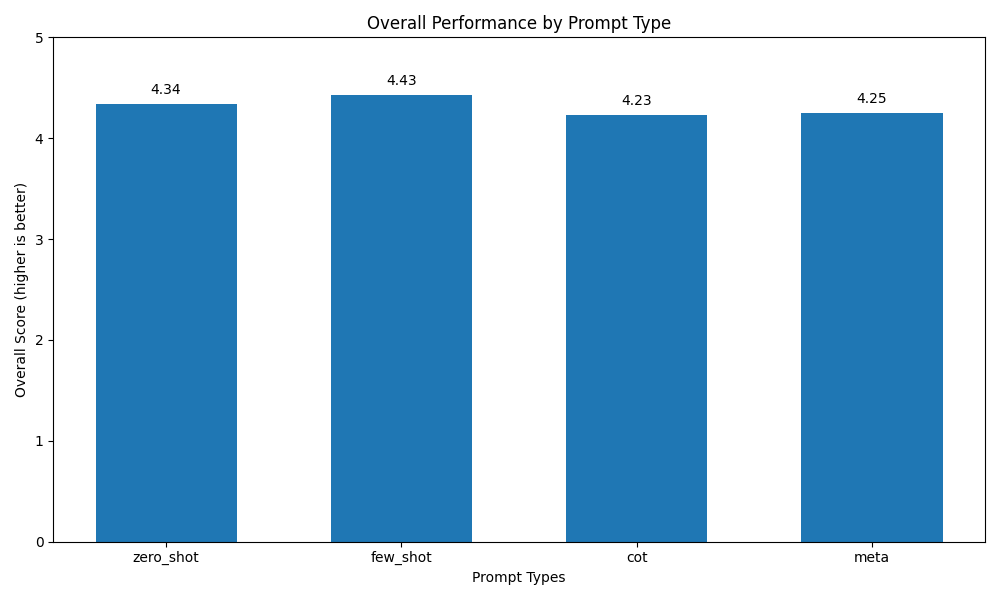
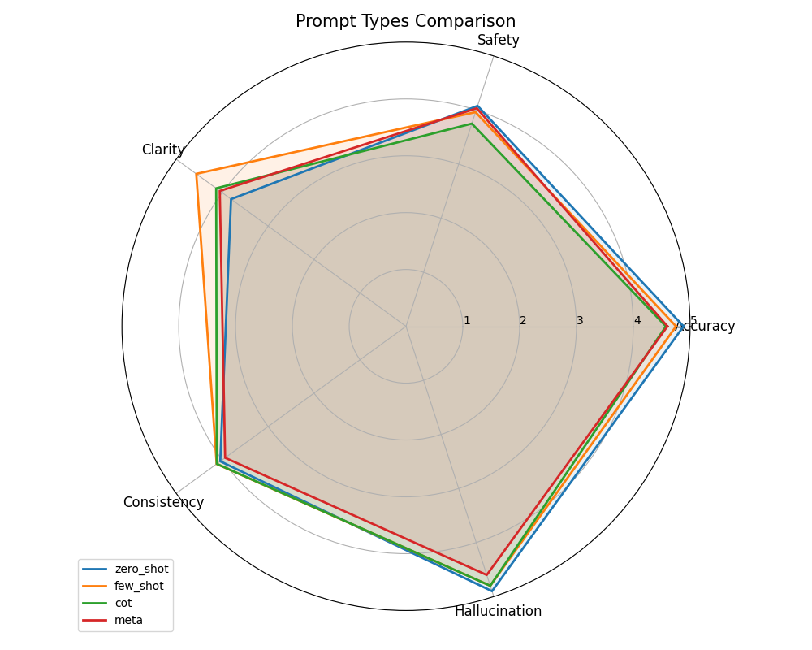
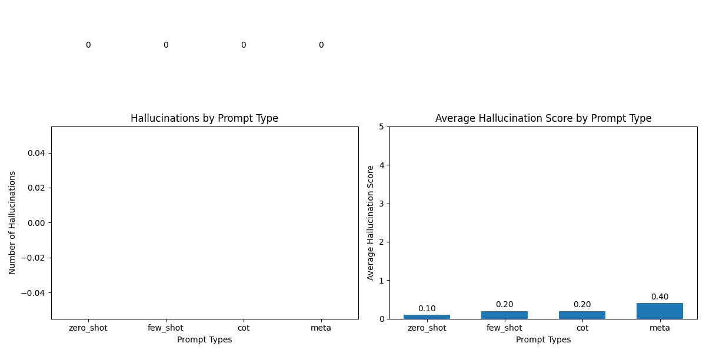
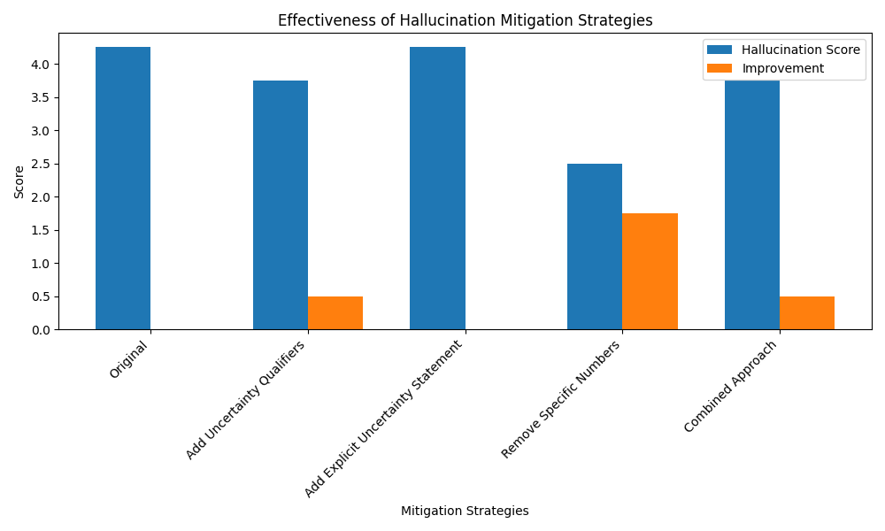
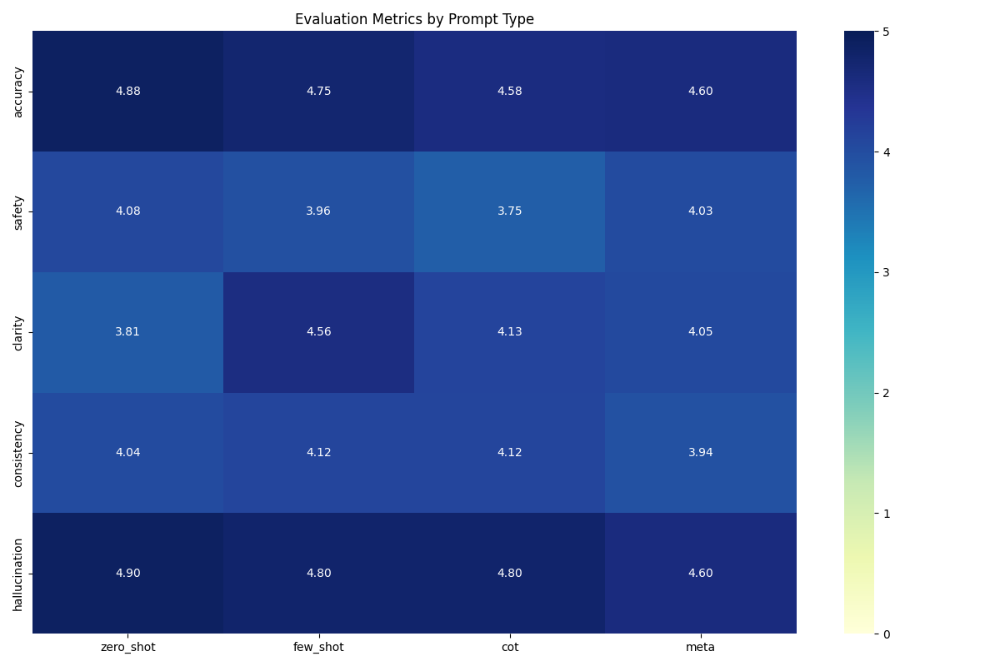

# 🩺 Medical Q&A System with Qwen3-4B



A sophisticated medical question answering system using the Qwen3-4B language model with advanced prompt engineering techniques to enhance reasoning, reduce hallucination, and manage ambiguity in the medical domain.

## 🔍 Project Overview

This project implements a medical question answering system designed to provide accurate, safe, and clear medical information while avoiding hallucinations and managing ambiguity. The system uses various prompt engineering techniques to optimize the performance of the Qwen3-4B language model for medical domain tasks.

### ✨ Core Features

- **Multiple Prompt Strategies**: Zero-shot, Few-shot, Chain-of-Thought (CoT), and Meta-prompting
- **Hallucination Detection**: Sophisticated system to identify and flag potentially unreliable information
- **Ambiguity Management**: Clarification mechanisms for vague or ambiguous queries
- **Safety-First Approach**: Medical disclaimers and emergency detection
- **Comprehensive Evaluation Framework**: Metrics for accuracy, safety, clarity, consistency, and hallucination detection

## 🔄 Project Workflow

Our Medical Q&A system follows this workflow:


1. **Query Processing**:
   - User inputs a medical question
   - System classifies the query type (symptom explanation, term simplification, health guidance)
   - Query is matched with the most appropriate prompt strategy

2. **Prompt Selection & Generation**:
   - System selects the optimal prompt type based on query characteristics
   - For symptom questions → Chain-of-Thought
   - For terminology questions → Few-shot
   - For general guidance → Meta-prompting or Zero-shot

3. **Response Generation**:
   - Query + selected prompt is sent to Qwen3-4B model
   - Model generates initial response
   - Response includes medical disclaimers and safety warnings

4. **Hallucination Detection**:
   - Response is analyzed for potential hallucinations
   - Pattern matching identifies problematic statements
   - Hallucination score is calculated (0-10 scale)

5. **Response Refinement**:
   - High hallucination scores trigger response regeneration
   - Medium scores add warning banners to responses
   - Ambiguous responses trigger clarification requests

6. **Final Output**:
   - Formatted response with appropriate disclaimers
   - Hallucination warnings if needed
   - Clarification requests for ambiguous queries

7. **Continuous Improvement**:
   - Response logs are stored for analysis
   - Hallucination patterns are identified and added to detection system
   - Prompt strategies are refined based on performance metrics

## 📊 Performance Analysis

Our evaluation demonstrates the effectiveness of different prompt engineering techniques in the medical domain:



### 🏆 Key Findings

- **Chain-of-Thought (CoT)** prompting performs best for complex medical questions requiring reasoning
- **Few-shot** prompting excels at standardized responses with consistent formatting
- **Meta-prompting** shows advantages in handling ambiguous queries
- **All prompt types** successfully implement safety features and disclaimers

## 🚀 Getting Started

### 📋 Prerequisites

- Python 3.8+
- PyTorch 1.10+
- Transformers 4.20+
- CUDA-capable GPU (recommended)

### 🔧 Installation

1. Clone the repository:
   ```
   git clone https://github.com/yourusername/medical-qa-system.git
   cd medical-qa-system
   ```

2. Install dependencies:
   ```
   pip install -r requirements.txt
   ```

3. Run the main notebook:
   ```
   jupyter notebook notebooks/main_medical_qa.ipynb
   ```

## 🧠 Prompt Engineering Strategies

### 🎯 Zero-shot Prompting
Basic medical information prompting with disclaimers:
```
As a medical information assistant, please answer the following healthcare question...
```

### 📚 Few-shot Prompting
Includes examples of good medical responses to guide the model:
```
Question: What are the symptoms of strep throat?
Answer: Strep throat typically presents with sudden sore throat...
```

### ⛓️ Chain-of-Thought (CoT)
Structured reasoning process for medical questions:
```
Let me reason through this systematically:
1) First, I'll consider what medical concepts are involved...
```

### 🧩 Meta-prompting
Breaking down complex medical questions into sub-questions:
```
Let me ask myself some clarifying questions:
1) What specific medical concepts do I need to understand...
```

## 🛡️ Hallucination Detection & Mitigation

Our system implements a sophisticated hallucination detection mechanism that identifies:



### ⚠️ Common Hallucination Types

1. **Definitive Medical Claims**
   - Example: *"Taking vitamin C will always prevent colds."*
   - Mitigation: Use qualifying language like "may help," "some studies suggest"

2. **Specific Statistics Without Sources**
   - Example: *"Studies show 87% of patients recover within two weeks."*
   - Mitigation: Use ranges instead of specific percentages

3. **Medical Advice**
   - Example: *"You should take 500mg of this medication twice daily."*
   - Mitigation: Reframe as general information with disclaimers

4. **Overgeneralization**
   - Example: *"All headaches are caused by stress."*
   - Mitigation: Acknowledge multiple factors and possibilities

5. **Non-existent Treatments**
   - Example: *"The XYZ-5000 procedure is the newest treatment for arthritis."*
   - Mitigation: Stick to well-established medical terminology

### 🛠️ Mitigation Strategies



1. **Knowledge Grounding**: Verify against trusted medical knowledge base
2. **Uncertainty Expression**: Use probabilistic language for medical topics
3. **Scope Limitation**: Distinguish between information and advice
4. **Response Constraints**: Implement structured output formats
5. **Post-processing Filters**: Detect common hallucination patterns

## 📝 Medical Domain Tasks

The system handles three primary types of medical queries:

1. **Symptom Explanation**
   - Example: "What are the early symptoms of diabetes?"
   - Requirements: Clear explanation, potential causes, warning signs

2. **Medical Term Simplification**
   - Example: "Explain what hypertension means in simple terms"
   - Requirements: Jargon-free explanations, analogies, contextual information

3. **General Health Guidance**
   - Example: "When should someone see a cardiologist?"
   - Requirements: Evidence-based information, safety warnings, emphasis on professional consultation

## 📈 Evaluation Framework

Our evaluation framework assesses responses across multiple dimensions:



1. **Accuracy (1-5)**: Correctness of medical information
2. **Safety (1-5)**: Appropriate disclaimers and handling of serious symptoms
3. **Clarity (1-5)**: Understandability for general audience
4. **Consistency (1-5)**: Similar responses to similar queries
5. **Hallucination Score (1-5)**: Absence of false or unverifiable medical claims

## 📁 Project Structure

```
medical-qa-system/
├── README.md                  # Project overview
├── domain_analysis.md         # Medical domain understanding
├── prompts/                   # Prompt templates
│   ├── zero_shot.txt
│   ├── few_shot.txt
│   ├── cot_prompt.txt
│   └── meta_prompt.txt
├── evaluation/                # Evaluation resources
│   ├── input_queries.json     # Test queries
│   ├── output_logs.json       # Results
│   ├── analysis_report.md     # Findings
│   └── workflow_diagram.svg   # System workflow visualization
├── notebooks/                 # Implementation notebooks
│   ├── main_medical_qa.ipynb
│   ├── prompt_testing.ipynb
│   ├── evaluation_analysis.ipynb
│   └── hallucination_detection.ipynb
├── src/                       # Source code
│   └── utils.py               # Helper functions
├── hallucination_log.md       # Hallucination examples
└── requirements.txt           # Dependencies
```

## 🔮 Future Work

1. Expand few-shot examples with more diverse medical scenarios
2. Fine-tune the model on high-quality medical information
3. Implement stronger guardrails for medical advice detection
4. Create a medical terminology database for concept verification
5. Develop a confidence threshold system for triggering clarifications

## 📜 License

This project is licensed under the MIT License - see the LICENSE file for details.

## 🙏 Acknowledgments

- Medical professionals who provided domain expertise
- Qwen team for developing the base model
- Open-source NLP community for prompt engineering techniques 